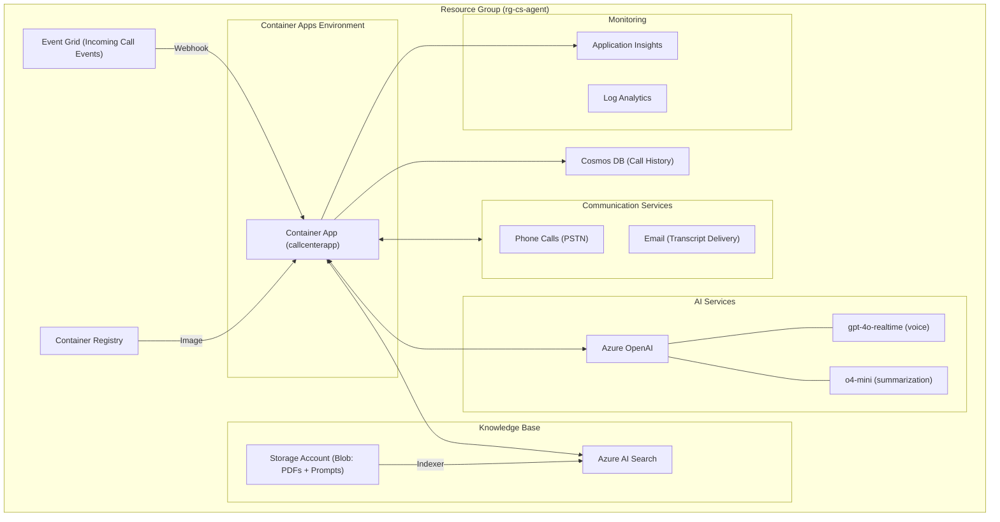
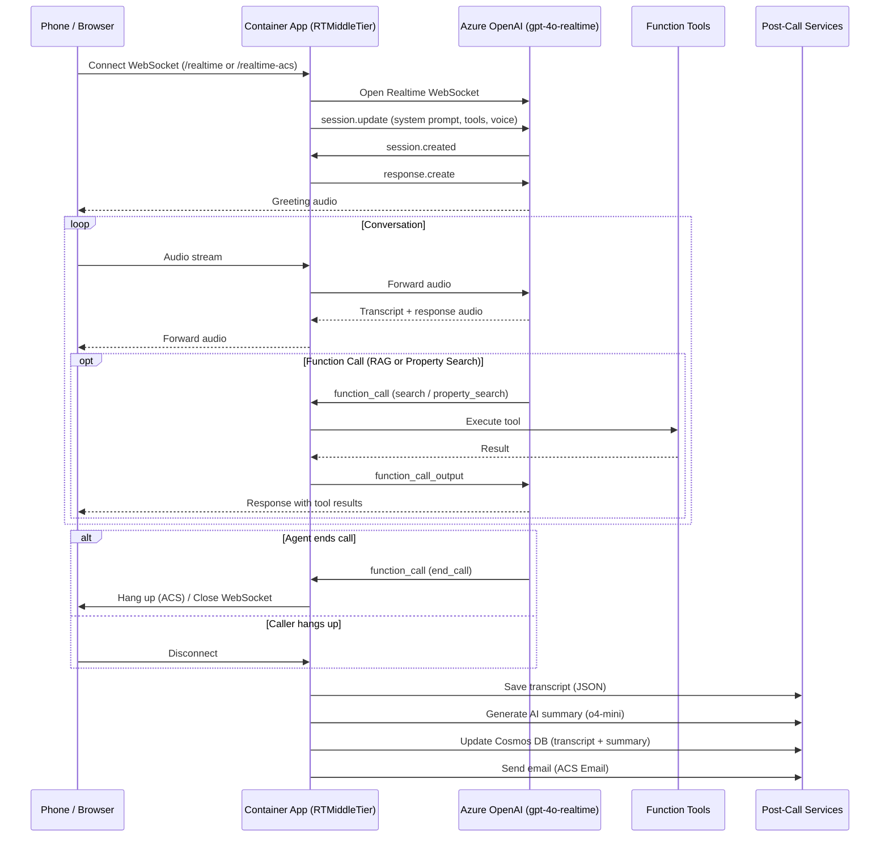
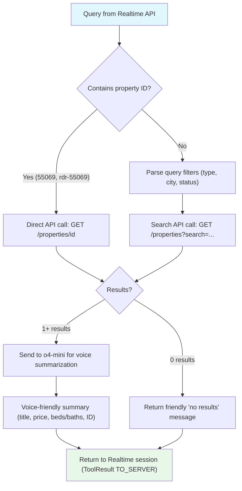

# Architecture

## Azure Infrastructure

### Resource Summary

| Resource | Purpose |
|----------|---------|
| **Container App** | Hosts the Python/aiohttp application with gunicorn |
| **Container Registry** | Stores Docker images built by `az acr build` |
| **Azure OpenAI** | gpt-4o-realtime for voice conversations; o4-mini for call summarization and property search summarization |
| **Communication Services** | PSTN phone calls (inbound/outbound) and email delivery for transcripts |
| **AI Search** | Semantic + vector search over knowledge base documents (RAG) |
| **Storage Account** | Blob storage for knowledge base PDFs (`content` container) and system prompt override (`prompt` container) |
| **Event Grid** | Routes incoming call events from ACS to the `/acs/incoming` webhook |
| **Cosmos DB** | Persistent call history — one document per call with transcript, AI summary, lead info, and lifecycle status. Database: `call_center`, Container: `calls`, partitioned by `/phone_number`. |
| **Application Insights + Log Analytics** | Telemetry, logging, and monitoring |

## Call Data Flow

### WebSocket Routes

| Route | Client | Protocol |
|-------|--------|----------|
| `/realtime` | Web browser | OpenAI Realtime format |
| `/realtime-acs` | ACS phone call | ACS Media Streaming → transformed to OpenAI format |

### Function-Calling Tools

| Tool | Direction | Purpose |
|------|-----------|---------|
| `search` | TO_SERVER | RAG search against Azure AI Search knowledge base |
| `report_grounding` | TO_CLIENT | Cite sources from knowledge base (web UI only) |
| `property_search` | TO_SERVER | Search realtordr.com listings or look up by property ID |
| `end_call` | TO_SERVER | Disconnect the call after the agent says goodbye (ACS hang_up or WebSocket close) |

## Property Search Flow

### Taxonomy Cache

At startup, the app fetches WordPress taxonomy terms (property types, cities, statuses) from the realtordr.com API and caches them in memory. If the API is unreachable, hardcoded fallback IDs are used. The cache maps natural-language terms (e.g., "villa", "cabarete") to WordPress taxonomy IDs for API filtering.

## Backend Components

| Module | File | Responsibility |
|--------|------|---------------|
| **RTMiddleTier** | `src/app/backend/rtmt.py` | Central middleware. Manages bidirectional WebSocket forwarding between clients and OpenAI Realtime API. Intercepts function calls, captures transcripts. |
| **AcsCaller** | `src/app/backend/acs.py` | Phone call lifecycle via ACS. Handles outbound/inbound calls, media streaming, call events. Triggers post-call processing (transcript save, summary, email). |
| **TranscriptManager** | `src/app/backend/transcript_manager.py` | Session-based transcript tracking with timestamps. Saves transcripts as JSON to `call_logs/`. Generates HTML for email. |
| **CallSummarizer** | `src/app/backend/call_summarizer.py` | Uses o4-mini to generate call summaries with lead qualification and consultation details from transcripts. |
| **EmailService** | `src/app/backend/email_service.py` | Sends HTML-formatted transcript emails via ACS Email after calls complete. |
| **CosmosCallLogger** | `src/app/backend/cosmos_service.py` | Logs call records to Azure Cosmos DB through the full lifecycle (initiated → connected → summarizing → completed). Stores transcript, AI summary, lead info, and errors. Auto-creates database and container on startup. |
| **Property Search** | `src/app/backend/tools/realtordr/property_search.py` | Queries realtordr.com WordPress API for listings. Supports search by criteria or direct ID lookup. Summarizes results via o4-mini for voice. |
| **End Call** | `src/app/backend/tools/end_call.py` | Allows the AI agent to programmatically disconnect calls via ACS `hang_up` or WebSocket close. |
| **AI Search (RAG)** | `src/app/backend/tools/rag/ai_search.py` | Hybrid semantic + vector search against Azure AI Search. Provides `search_tool` and `report_grounding_tool`. |
| **Azure Helpers** | `src/app/backend/azure.py` | Credential management (`DefaultAzureCredential` or API key). Fetches system prompt from Azure Storage blob. |
