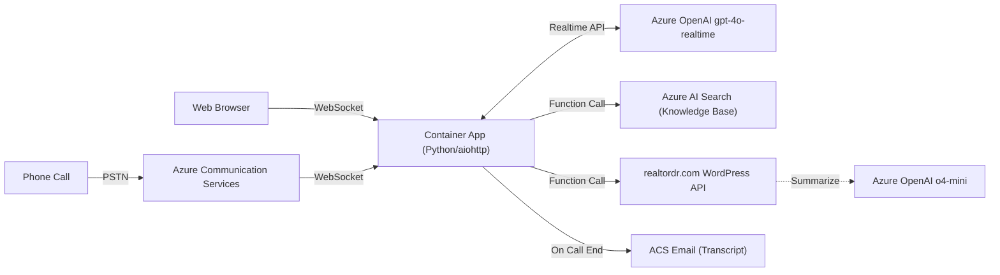

# MacHenry Realtor AI Call Center

AI-powered call center for [MacHenry Realtor](https://realtordr.com), built on Azure Communication Services and the OpenAI Realtime API. Callers interact with **Mackenzie**, an AI assistant who answers questions about Dominican Republic real estate, searches live property listings, qualifies leads, and schedules consultations — all through natural voice conversation over phone or web.

Forked from [Azure-Samples/Realtime-Call-Center-Solution-Accelerator](https://github.com/Azure-Samples/Realtime-Call-Center-Solution-Accelerator).

## Architecture Overview



## Customizations from Fork

This repo extends the original Azure Solution Accelerator with the following features:

| Feature | Description |
|---------|-------------|
| **MacHenry Realtor Branding** | Custom system prompt, frontend styled to match realtordr.com |
| **Real-Time Property Search** | Function-calling tool that queries the WordPress REST API at realtordr.com, with o4-mini voice summarization |
| **Property ID Lookup** | Direct lookup by ID (`55069`, `rdr-55069`) via the WordPress API |
| **Call Transcription** | Automatic transcript capture during calls, saved as JSON to `call_logs/` |
| **AI Call Summarization** | o4-mini generates summaries with lead qualification and consultation details |
| **Email Notifications** | HTML-formatted transcript emails sent via ACS Email after each call |
| **Bulk Calling** | Automated outbound calls to a list of phone numbers (`scripts/bulk_call/`) |
| **Simplified Deploy Script** | One-command deploy via `scripts/deploy.sh` (ACR build + container update) |
| **Azure Recovery Stack** | Terraform configuration and CLI scripts for resource cleanup/recreation (`infra/recovery/`) |
| **English-Default Language** | Mackenzie speaks English unless the caller initiates in Spanish |
| **Auto Hang-Up** | `end_call` tool lets the AI agent disconnect after saying goodbye (ACS hang_up or WebSocket close) |
| **Multiple System Prompts** | Archived prompts for Santorini Estiatorio, Gold Standard Construction, EVITAVONNI |

## Documentation

| Document | Description |
|----------|-------------|
| [Features](FEATURES.md) | Implemented features list, recommended tools and integrations with implementation tracking |
| [Architecture](ARCHITECTURE.md) | Infrastructure diagrams, call data flow, property search flow, component details |
| [Deployment](DEPLOYMENT.md) | Deploy scripts, local dev setup, environment variables, troubleshooting |
| [Standards](STANDARDS.md) | Coding patterns, tool authoring guide, commit conventions, branch strategy |
| [CLAUDE.md](../CLAUDE.md) | Project guidance for Claude Code (commands, architecture summary, env vars) |

## Directory Structure

```
customer-support-agent/
├── src/app/                          # Application code
│   ├── app.py                        # Entry point (aiohttp web server)
│   ├── system_prompt.md              # Active AI agent prompt
│   ├── backend/                      # Backend modules
│   │   ├── rtmt.py                   # OpenAI Realtime middleware
│   │   ├── acs.py                    # Azure Communication Services
│   │   ├── transcript_manager.py     # Transcript capture & storage
│   │   ├── call_summarizer.py        # AI summarization (o4-mini)
│   │   ├── email_service.py          # Email delivery
│   │   ├── azure.py                  # Azure credentials & storage
│   │   ├── helpers.py                # Utilities
│   │   └── tools/                    # Function-calling tools
│   │       ├── tools.py              # Tool base classes
│   │       ├── end_call.py           # Auto hang-up tool
│   │       ├── rag/ai_search.py      # Azure AI Search (RAG)
│   │       └── realtordr/            # Property search tool
│   └── static/                       # Frontend (HTML/JS/CSS)
├── infra/                            # Bicep IaC templates
│   └── recovery/                     # Terraform recovery stack
├── scripts/
│   ├── deploy.sh                     # Quick deploy (ACR build + update)
│   ├── upload_data.sh                # Knowledge base upload
│   └── bulk_call/                    # Bulk calling automation
├── azd-hooks/                        # Azure Developer CLI hooks
│   └── deploy.sh                     # Full provisioning deploy
├── tests/                            # Test suite
├── data/                             # Knowledge base PDFs
├── call_logs/                        # Runtime transcripts & logs
└── docs/                             # This documentation folder
```

## Quick Start

```bash
# Deploy a code change
bash scripts/deploy.sh

# Run locally
source .venv/bin/activate
source <(azd env get-values)
python src/app/app.py

# Provision a new environment
azd auth login
azd up
```

See [Deployment](DEPLOYMENT.md) for full instructions.
